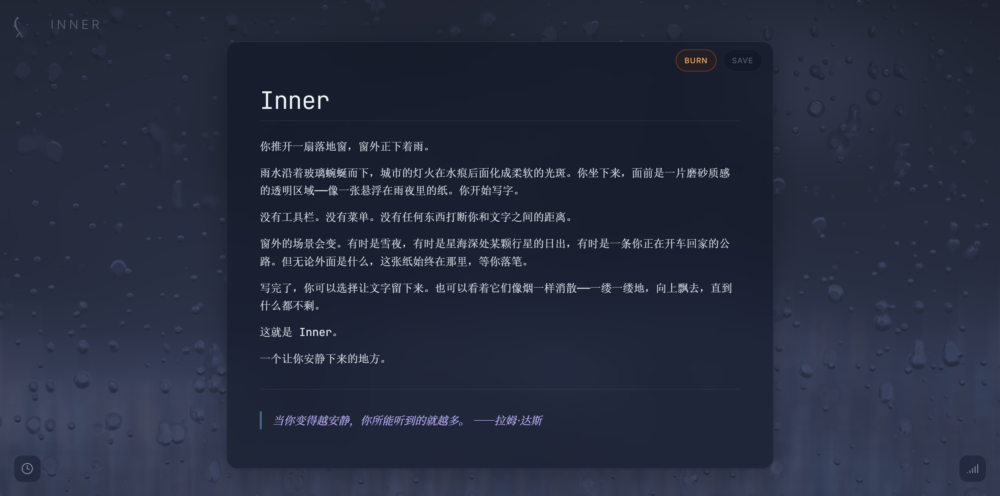
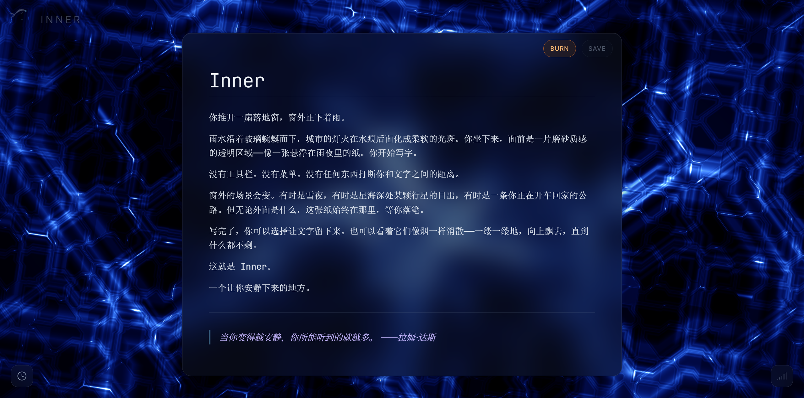
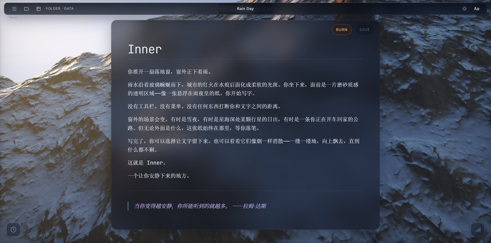
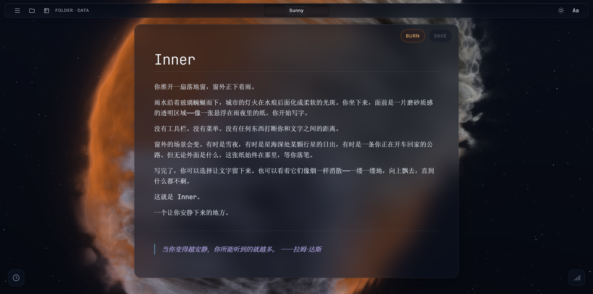
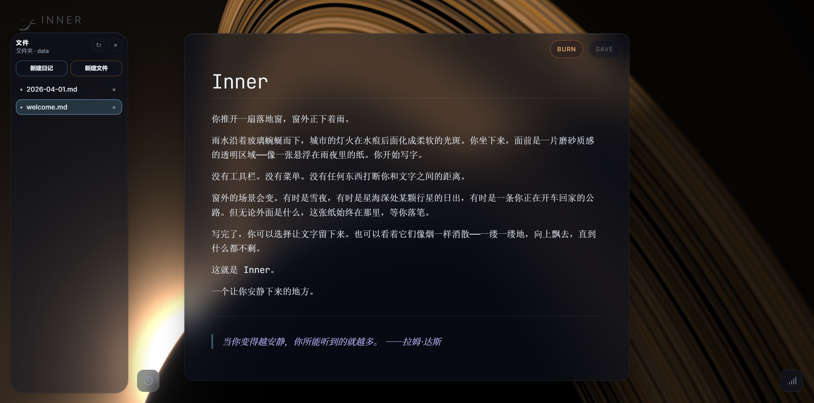
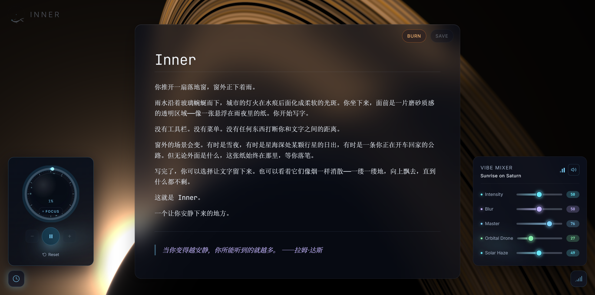
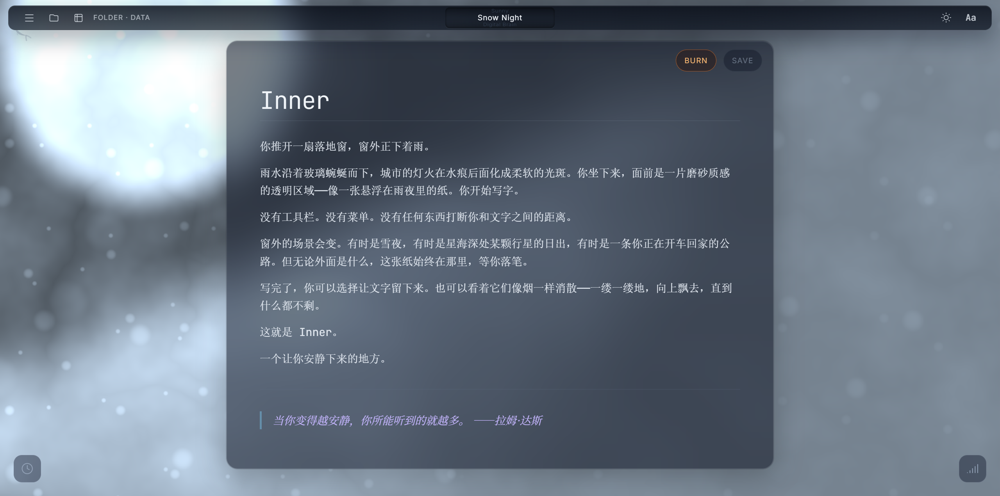
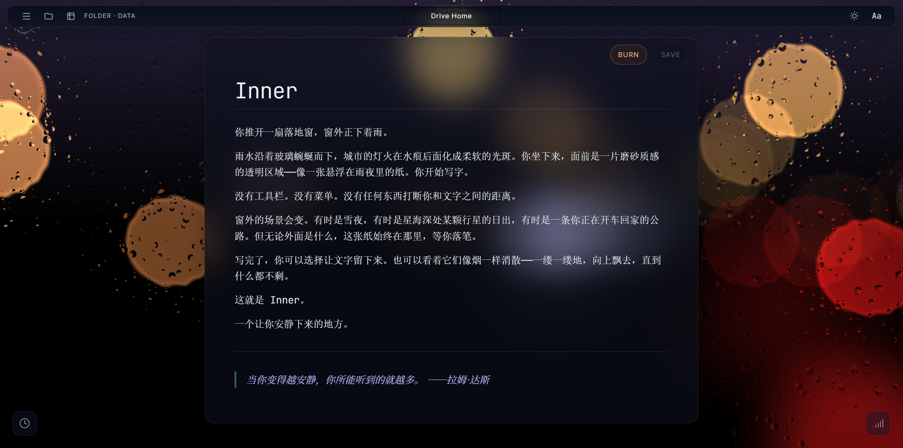

# Inner

> 一个让你安静下来写字的地方。

<p align="center">
  <a href="resource/20260401-033949.mp4">
    
  </a>
</p>

<p align="center">
  
  
</p>
<p align="center">
  
  
</p>
<p align="center">
  
  
</p>
<p align="center">
  
</p>

Inner 是一个沉浸式 Markdown 笔记应用。全屏的 WebGL 着色器场景作为背景，磨砂玻璃质感的编辑器浮于其上，搭配程序化生成的环境音——为专注书写和深度思考而设计。

## 功能

### 视觉底座 (The Canvas)
- 基于 WebGL/Three.js 的全屏动态着色器背景
- **10 个沉浸场景**：Night Rain / Rain Day / Thunderstorm / Sunny / Snow Night / Digital Brain / Drive Home / Sunrise on Saturn / Lone Planet and the Sun / Light Circles
- 实时可调的场景强度与模糊度

### 沉浸编辑器 (The Deck)
- 磨砂玻璃浮动编辑面板，基于 Milkdown 的 Markdown 渲染
- 支持 GFM (GitHub Flavored Markdown)、数学公式 (KaTeX)、表格
- 三种字体可选：Sans (Inter) / Serif (Noto Serif SC) / Mono (JetBrains Mono)
- 失焦自动保存 + 10 秒空闲自动保存
- **写后即焚**：清空文档时文字如烟雾般消散

### 氛围控制台 (Vibe Mixer)
- 隐藏式浮窗面板，滑杆控制：
  - 场景强度 / 模糊度
  - 主音量 / 环境声双层混音 / 可选音乐轨
- 每个场景有独立的音频配置（合成器类型 + 滤波器参数）
- 支持外部音频资源 (`public/audio/manifest.json`)

### 心流计时器 (Zen Timer)
- 环形倒计时 + 粒子轨道动画
- 滚轮调节时长，1~120 分钟

### 文件管理
- 内置 Express 服务端 + WebSocket 实时同步
- 支持浏览器 File System Access API（选择本地文件夹）
- 文件侧边栏：新建 / 重命名 / 删除 / 切换文件
- Markdown 文件持久化存储

### 主题与个性化
- 深色 / 浅色主题切换，自动保存偏好
- 全局 CSS 变量驱动，0.3s 平滑过渡
- 品牌标识：水墨双鲸追逐动画

## 技术栈

| 层 | 技术 |
|---|---|
| 框架 | Vue 3.5 + TypeScript 5.9 |
| 构建 | Vite 8 |
| 样式 | Tailwind CSS 4.2 |
| 渲染 | Three.js 0.183 + GLSL 着色器 |
| 编辑器 | Milkdown 7.20 (ProseMirror) |
| 公式 | KaTeX 0.16 |
| 音频 | Web Audio API (程序化合成) |
| 服务端 | Express 5 + WebSocket |
| 文件监听 | Chokidar 5 |

## 快速开始

```bash
# 安装依赖
cd app && npm install

# 开发模式（前端 + 后端同时启动）
npm run dev

# 仅构建前端
npm run build
```

数据默认存储在 `data/` 目录。

## 项目结构

```
Inner/
├── app/
│   ├── src/
│   │   ├── components/     # Vue 组件 (Editor, TopBar, VibeMixer, ZenTimer, ...)
│   │   ├── composables/    # 逻辑组合 (useShader, useAudio, useFileSystem, useTheme)
│   │   ├── shaders/        # GLSL 片段着色器 (10 个场景)
│   │   └── styles/         # 全局样式 + 主题变量
│   ├── server/             # Express + WebSocket 服务端
│   └── public/             # 静态资源 (favicon, icons)
├── data/                   # 用户笔记文件
└── README.md
```

## 设计理念

**赛博禅意 (Cyber Zen)** —— 所有 UI 元素在非活跃状态下趋近透明，鼠标移入时优雅淡入。编辑器、控制面板、计时器都遵循这一原则：不打断你和文字之间的距离。

数据完全本地化，无外部追踪，无云端依赖。

## 许可

着色器 "Night Rain" 改编自 [Heartfelt](https://www.shadertoy.com/view/4t33z8) by Martijn Steinrucken (BigWings)，遵循 CC BY-NC-SA 3.0 协议。
